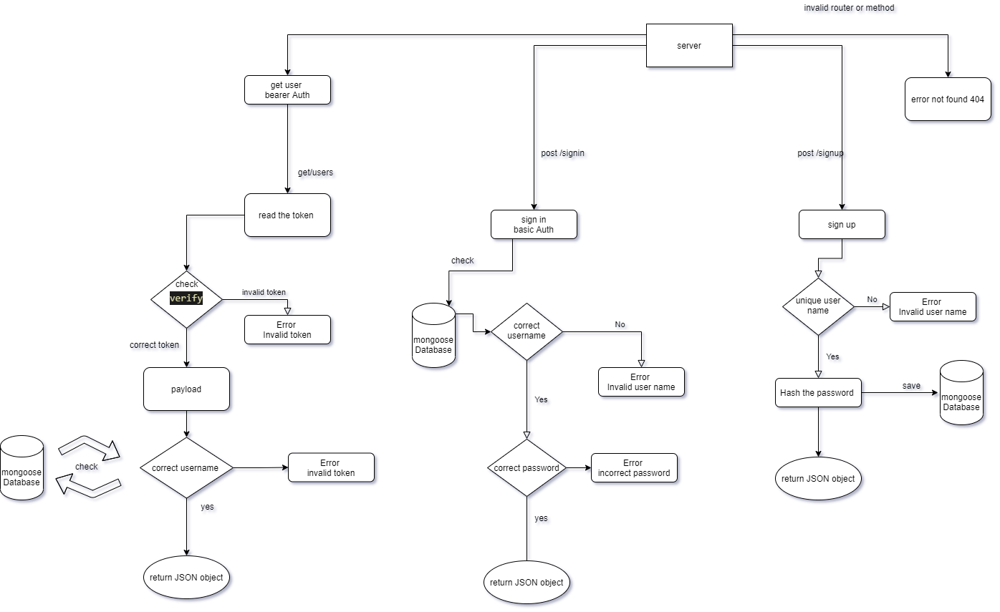

# basic-api-server


**V1.1**

## Author 

Mousa Sabah

## About 

a REST API using Express, by creating a proper series of endpoints that perform CRUD operations on a Mongo Database

## Deployment 
This project use Heroku to deployment

API Live Url: **https://mousa-basic-api-server.herokuapp.com/**

## Pull Request 

This is the Main Pull Request for this project :

https://github.com/MousaSbbah/api-server/pull/1


## Setup
   .env requirements

      PORT - 3030
      MONGOOSE_URI -  mongodb://********************
## Running the app
```
npm start
```
Endpoint: 
* `/student`
  Return JSON objects 
    ```json
      [
        {
      "name": "studentName",
      "age": 24,
      "grade": 90%
      }
      ]
    ```
* `/animal`

    Return JSON objects 
    ```json
      [
        {
      "name": "dog",
      "legs": 4,
      }
      ]
    ```

## Tests
Github actions link :**https://github.com/MousaSbbah/api-server/runs/2624852021?check_suite_focus=true**

**Unit Tests:**
```
npm run test
```

## 
    
## UML



